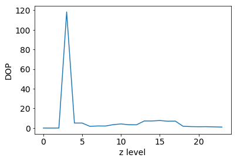

```python
import pyspark
import sys
import pyspark.sql.functions as sql

print(sys.version)
print(sys.path)

from pyspark import SparkContext
from pyspark import SQLContext
from pyspark.sql import Row
from pyspark.sql import functions as F
from pyspark.sql.types import *
from pyspark.sql import Window

import pandas as pd
```

    3.6.4 |Anaconda, Inc.| (default, Jan 16 2018, 18:10:19) 
    [GCC 7.2.0]
    ['/usr/lib/spark/python/lib/py4j-src.zip', '/tmp/spark-05d0ff43-4a25-4d91-af18-917584dc7a3d/userFiles-62694f2a-8dd4-46f9-9901-d77991a7cce3', '/usr/lib/spark/python/pyspark', '/usr/lib/spark/python', '', '/opt/anaconda3/lib/python36.zip', '/opt/anaconda3/lib/python3.6', '/opt/anaconda3/lib/python3.6/lib-dynload', '/opt/anaconda3/lib/python3.6/site-packages', '/opt/anaconda3/lib/python3.6/site-packages/IPython/extensions', '/home/uboos/.ipython']


### Load Trajectory Data

* Set data path to csv file with trajectory data
* Define schema for header of data frame
* Read csv with spark.read.option().schema(schema).csv


```python
# set folder structure/ data to import
folder_id = '22740'
data_root_path = 'inter-data'
raw_fn = folder_id + '.csv'

#data = r'/user/cfu/inter-data/54210.csv'
```


```python
# schema of cvs to be imported
schema = StructType([
                    StructField('vehicle', StringType()),
                     StructField('engineStatus', IntegerType()),
                     StructField('driverEvent', StringType()),
                     StructField('localDate', TimestampType()),
                     StructField('longitude', DoubleType()),
                     StructField('latitude', DoubleType()),
                     StructField('traj_id', IntegerType()),
                     StructField('wp_seq', IntegerType()),
                     StructField('x', DoubleType()),
                     StructField('y', DoubleType()),
                     StructField('zorder', LongType())])
```


```python
df = spark.read.option("header","false").schema(schema)\
    .csv(os.path.join(data_root_path, raw_fn))    
```

    +-----------+------------+-----------+--------------------+---------+------------------+-------+------+------------------+------------------+---------------+
    |    vehicle|engineStatus|driverEvent|           localDate|longitude|          latitude|traj_id|wp_seq|                 x|                 y|         zorder|
    +-----------+------------+-----------+--------------------+---------+------------------+-------+------+------------------+------------------+---------------+
    |7580_131330|           1|       null|2018-04-11 19:02:...|22.956713|         40.710291| 129852|   178| 2555529.601447324|   4969703.1101093|106824754243122|
    |7580_131330|           1|       null|2018-04-11 19:03:...|22.952536|40.705740999999996| 129852|   179|  2555064.61993428|4969034.9374345075|106824754675363|
    |7580_131330|           1|       null|2018-04-11 19:03:...|22.950063|         40.700556| 129852|   180|2554789.3268335476| 4968273.569934928|106824756067414|
    |7580_131330|           1|       null|2018-04-11 19:04:...|22.947428|         40.695364| 129852|   181| 2554495.999975309|4967511.2339349445|106824756573479|
    |7580_131330|           1|       null|2018-04-11 19:04:...|22.944044|         40.690601| 129852|   182|2554119.2948184647| 4966811.939809284|106824846168339|
    +-----------+------------+-----------+--------------------+---------+------------------+-------+------+------------------+------------------+---------------+
    only showing top 5 rows
    


### Extract Origin and Destination

* Extract origin (min(wp_seq)) for each trip of vehicle
* Extract destination (max(wp_seq)) for each trip of vehicle
* For O&D save coordinates & Z-Order code to csv


Notes on functions

* withColumn(): Returns a new DataFrame by adding a column or replacing the existing column that has the same name.


```python
# origin
w = Window.partitionBy('traj_id', 'vehicle')
trip_origin = df.withColumn('min_wp_seq', F.min('wp_seq').over(w))\
.where(F.col('wp_seq') == F.col('min_wp_seq')).drop('min_wp_seq')

```


```python
# destination
trip_destination = df.withColumn('max_wp_seq', F.max('wp_seq').over(w))\
.where(F.col('wp_seq') == F.col('max_wp_seq')).drop('max_wp_seq')
```

### Analyse Output of OD

* Analyse z-order of origins and destinations
    * Extract z-order for different levels of tree
    * Are origin and destination in the same grid at one level?
    * At which level(s) is a pattern visible?
    

* Compute some statistics
    * Count # trajectory origins in the same grid
    * Show histogram: in which grid cells are the most trajectories originating?
    

* No. Levels = 24

#### Convert Z-Order (int) to binary code


```python
def z_to_z_str(z):
    bin_z = bin(z)[2:]
    #Fill in the missing 0s. For instance, if a node is 0->0->1, 
    #the binary only returns 1 digit: 1, but the actually represent is 001
    bin_z = '0' * (48 - len(bin_z)) + bin_z
    return bin_z
```


```python
# rename columns - origin
trip_origin = trip_origin.withColumnRenamed('vehicle', 'vehicle_O')\
    .withColumnRenamed('engineStatus', 'O_engineStatus')\
    .withColumnRenamed('localDate', 'O_localDate')\
    .withColumnRenamed('longitude', 'O_longitude')\
    .withColumnRenamed('latitude', 'O_latitude')\
    .withColumnRenamed('wp_seq', 'O_wp_seq')\
    .withColumnRenamed('x', 'O_x')\
    .withColumnRenamed('y', 'O_y')\
    .withColumnRenamed('zorder', 'O_zorder')\
    
# destination

trip_destination = trip_destination.withColumnRenamed('vehicle', 'D_vehicle')\
    .withColumnRenamed('engineStatus', 'D_engineStatus')\
    .withColumnRenamed('localDate', 'D_localDate')\
    .withColumnRenamed('longitude', 'D_longitude')\
    .withColumnRenamed('latitude', 'D_latitude')\
    .withColumnRenamed('wp_seq', 'D_wp_seq')\
    .withColumnRenamed('x', 'D_x')\
    .withColumnRenamed('y', 'D_y')\
    .withColumnRenamed('zorder', 'D_zorder')\
```


```python
# join origin and destination df
trip_od = trip_origin.join(trip_destination, trip_origin.traj_id == trip_destination.traj_id)

trip_od = trip_od.where(trip_od.D_wp_seq != trip_od.O_wp_seq)

# get number of trips in origin-destination df
trip_od_recs = trip_od.collect()
print(len(trip_od_recs))
```

    365264


```python
# get vehicle numbers of current file
vehicles = [row['vehicle_O'] for row in trip_od_recs]
veh = []
for v in vehicles:
    if v not in veh:
        veh.append(v)
```


```python
# get pandas dataframe of trip_od
trip_od_recs_pd = pd.DataFrame.from_records(trip_od_recs)
trip_od_recs_pd.columns = trip_od_recs[0].__fields__
```


<div>
<style scoped>
    .dataframe tbody tr th:only-of-type {
        vertical-align: middle;
    }

    .dataframe tbody tr th {
        vertical-align: top;
    }

    .dataframe thead th {
        text-align: right;
    }
</style>
<table border="1" class="dataframe">
  <thead>
    <tr style="text-align: right;">
      <th></th>
      <th>vehicle_O</th>
      <th>O_engineStatus</th>
      <th>driverEvent</th>
      <th>O_localDate</th>
      <th>O_longitude</th>
      <th>O_latitude</th>
      <th>traj_id</th>
      <th>O_wp_seq</th>
      <th>O_x</th>
      <th>O_y</th>
      <th>...</th>
      <th>D_engineStatus</th>
      <th>driverEvent</th>
      <th>D_localDate</th>
      <th>D_longitude</th>
      <th>D_latitude</th>
      <th>traj_id</th>
      <th>D_wp_seq</th>
      <th>D_x</th>
      <th>D_y</th>
      <th>D_zorder</th>
    </tr>
  </thead>
  <tbody>
    <tr>
      <th>1209</th>
      <td>7580_74960</td>
      <td>1</td>
      <td>None</td>
      <td>2017-07-18 03:49:46</td>
      <td>23.720621</td>
      <td>37.984908</td>
      <td>629653</td>
      <td>0</td>
      <td>2.640567e+06</td>
      <td>4.577294e+06</td>
      <td>...</td>
      <td>3</td>
      <td>None</td>
      <td>2017-07-18 05:04:07</td>
      <td>23.662896</td>
      <td>38.012436</td>
      <td>629653</td>
      <td>99</td>
      <td>2.634142e+06</td>
      <td>4.581183e+06</td>
      <td>107215185069956</td>
    </tr>
    <tr>
      <th>1210</th>
      <td>7580_74960</td>
      <td>1</td>
      <td>None</td>
      <td>2017-07-21 05:13:14</td>
      <td>23.706980</td>
      <td>37.951648</td>
      <td>629734</td>
      <td>0</td>
      <td>2.639049e+06</td>
      <td>4.572598e+06</td>
      <td>...</td>
      <td>3</td>
      <td>None</td>
      <td>2017-07-21 05:28:41</td>
      <td>23.729935</td>
      <td>37.935586</td>
      <td>629734</td>
      <td>35</td>
      <td>2.641604e+06</td>
      <td>4.570330e+06</td>
      <td>107238118479391</td>
    </tr>
    <tr>
      <th>1211</th>
      <td>7580_74960</td>
      <td>1</td>
      <td>None</td>
      <td>2017-08-21 07:50:20</td>
      <td>23.715896</td>
      <td>38.012136</td>
      <td>630408</td>
      <td>0</td>
      <td>2.640041e+06</td>
      <td>4.581140e+06</td>
      <td>...</td>
      <td>3</td>
      <td>None</td>
      <td>2017-08-21 08:18:02</td>
      <td>23.744773</td>
      <td>38.064548</td>
      <td>630408</td>
      <td>39</td>
      <td>2.643256e+06</td>
      <td>4.588548e+06</td>
      <td>107215111734252</td>
    </tr>
    <tr>
      <th>1212</th>
      <td>7580_74960</td>
      <td>1</td>
      <td>None</td>
      <td>2017-09-07 13:28:32</td>
      <td>22.900964</td>
      <td>39.364058</td>
      <td>630619</td>
      <td>0</td>
      <td>2.549324e+06</td>
      <td>4.773955e+06</td>
      <td>...</td>
      <td>3</td>
      <td>None</td>
      <td>2017-09-07 13:29:25</td>
      <td>22.900968</td>
      <td>39.364058</td>
      <td>630619</td>
      <td>1</td>
      <td>2.549324e+06</td>
      <td>4.773955e+06</td>
      <td>107202657058782</td>
    </tr>
  </tbody>
</table>
<p>4 rows × 22 columns</p>
</div>


```python
# compute variance of the flow weights
import numpy as np
trip_od_veh = trip_od_recs_pd.loc[trip_od_recs_pd['vehicle_O'] == '160_138670'] # only show OD for specific vehicle

o_z = []
d_z = []
for row in trip_od_veh['O_zorder']: # get all Z-Orders for the origins
     o_z.append(row)

for row in trip_od_veh['D_zorder']: # get all Z-Orders for the destinations
    d_z.append(row)

# convert z-order to binary and save as string
o_z_str = [z_to_z_str(z) for z in o_z]
d_z_str = [z_to_z_str(z) for z in d_z]

od_z_str = [r for r in zip(o_z_str, d_z_str)]

# get max and second max value for each level
od_level = []
cnt = Counter()
variance_level = []

for level in range(1, 25): # get the variance for each level
    cnt = Counter()
    x_od_zorder = [(r[0][:2 * level], r[1][:2 * level]) for r in od_z_str]
    for nr in x_od_zorder:
        cnt[nr] += 1
    x_od_zorder_set = set(cnt)
    od_level.append([cnt])
    
    mostcommon = cnt.most_common()
    vrnc = np.var([count for key, count in mostcommon])
    variance_level.append(vrnc)
```


    [0.0,
     0.0,
     0.0,
     43644.5,
     28804.0,
     28804.0,
     6286.426666666667,
     4242.833333333333,
     2006.3424,
     992.5377229080933,
     633.6396130072561,
     375.07083825265653,
     276.9411498415573,
     247.3161982248521,
     222.35182998819357,
     213.50583333333336,
     193.16236686390536,
     118.53061224489795,
     44.39374921235034,
     15.424299802761348,
     5.3813855262270325,
     2.2562073282008717,
     1.0481725342649826,
     0.7156838727555312]


```python
# compute the degree of primacy
trip_od_veh = trip_od_recs_pd.loc[trip_od_recs_pd['vehicle_O'] == '7580_98860']

o_z = []
d_z = []
for row in trip_od_veh['O_zorder']:
     o_z.append(row)

for row in trip_od_veh['D_zorder']:
    d_z.append(row)

# convert z-order to binary and save as string
o_z_str = [z_to_z_str(z) for z in o_z]
d_z_str = [z_to_z_str(z) for z in d_z]

od_z_str = [r for r in zip(o_z_str, d_z_str)]

# get max and second max value for each level
od_level = []
cnt = Counter()
maxvals = []
dop = []

for level in range(1, 25): #until 25
    cnt = Counter()
    x_od_zorder = [(r[0][:2 * level], r[1][:2 * level]) for r in od_z_str]
    for nr in x_od_zorder:
        cnt[nr] += 1
    x_od_zorder_set = set(cnt)
    od_level.append([cnt])
    dopMax = cnt.most_common()[:][0][1]
    if len(cnt.most_common(2)) < 2:
        maxvals.append([dopMax])
    else:
        dopSec = cnt.most_common()[:2][1][1]
        maxvals.append([dopMax, dopSec])

dop

# calculate dop 
for val in maxvals:
    if len(val) < 2:
        m = 0
    else:
        m = val[0]/val[1]
    dop.append(m)
```


```python
# calculate the number of unique z-order values
o_z_str_unique = set(o_z_str)
d_z_set_unique = set(d_z_str)
print(len(o_z_str), len(d_z_str))
print(len(o_z_str_unique), len(d_z_set_unique), len(o_z_str_unique.union(d_z_set_unique)))
```

    4310 4310
    3721 3636 6383


```python
import matplotlib.pyplot as plt
plt.rcParams.update({'font.size': 14})
```


```python
# plot DOP
plt.plot([r for r in dop])
plt.xlabel('z level')
plt.ylabel('DOP')
plt.show()
```




